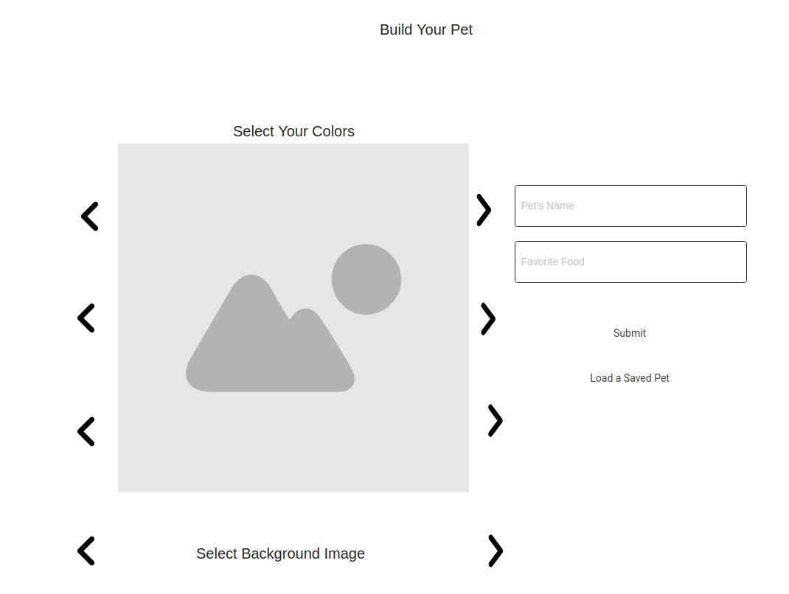
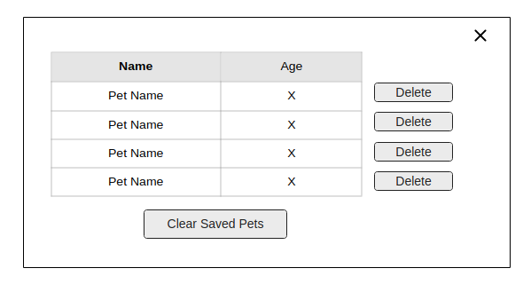
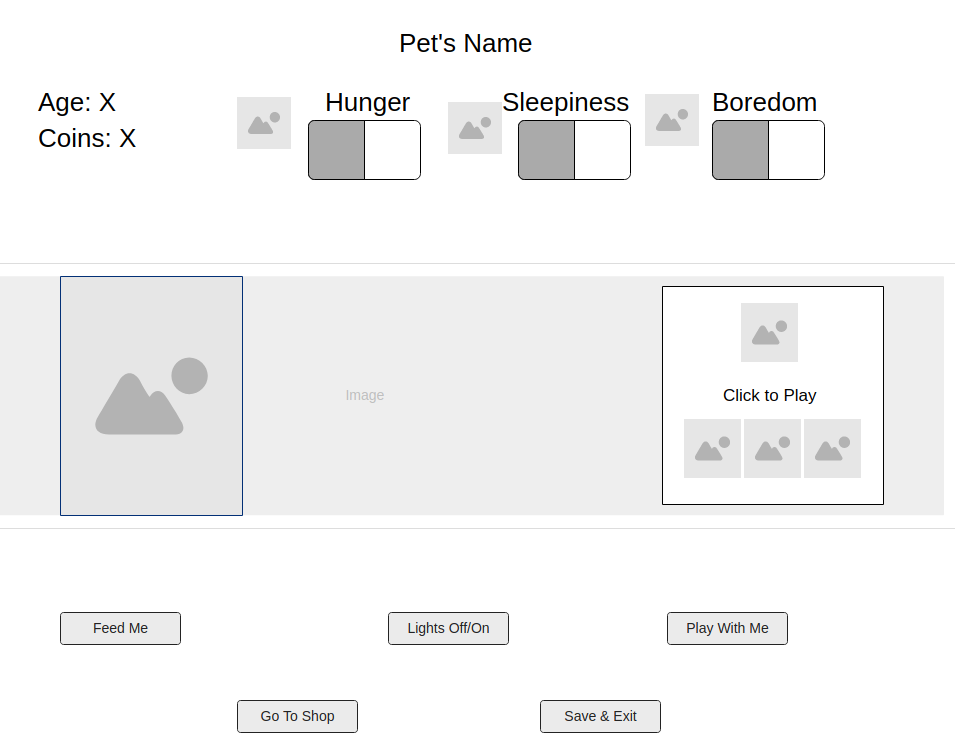
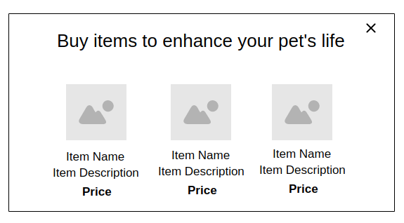

# Project Tamagotchi

## Objective
To create a working Tamagotchi-inspired game with an animated pet.
**[Click here to play the game](https://pages.git.generalassemb.ly/dcheng/tamagotchi/)**

## Technologies Used
* HTML
* CSS
* Javascript
* JQuery

## User Stories
* When users first load the game, they will see a splash screen with an animated egg and several customizable inputs:
    * 3 sets of color selectors to choose the colors for their pet, and 1 set of background image selectors to choose a setting.
    * Text input for pet name
    * Text input for favorite food
* Users may also load saved pets from previous games through the "Load a Saved Pet" button.
* When users click "Submit" or select a saved pet, the splash screen fades out and the game play screen fades in.
* On the game play screen, users will see three sections:
    * Stats: This section contains five metrics: Age, Hunger, Sleepiness, and Boredom which increase over time. It also displays the user's coin count which fluctuates as the user plays with their pet. A game message may also display in this section depending on the actions taken by the user.
        * If any of these metrics exceeds 10, the game screen fades out and a lose message fades in.
    * Pet Section: This section contains the animated pet with the custom colors and background image selected by the user.
    * Action Section: This section contains action buttons:
        * Feed Me: Each click results in one decrease in hunger.
        * Lights On/Off: Turning the lights off puts the pet to sleep. Sleeping incrementally decreases sleepiness, though hunger and boredom continue to increase while sleeping.
        * Play with Me: This button opens a Rock, Paper, Scissors game displayed in the pet section. The user makes a selection, then the pet's choice and result is revealed. The user wins and loses coins as a result.
        * Go to Shop: This button pauses all the timed intervals and opens the shop which sells the following items:
            * Bed - 30 coins: If this item is purchased, sleeping (lights off) reduces sleepiness faster.
            * Toy - 20 coins: If this item is purchased, boredom increases more slowly.
            * Feeder - 20 coins: If this item is purchased, hunger increases more slowly.
            * Word Guess Game - 10 coins: If this item is purchased, another action button is added ("Play Word Guess Game") and the "Play with Me" button is renamed to "Play Rock, Paper, Scissors." The user can choose which game to play to decrease boredom. Word Guess has higher stakes - the user can win more coins, but also lose more.
        * Save and Exit: This button saves the current pet and reloads the window.
* When a user purchases the final item in the shop, an end-game is triggered. Upon closing the shop, the user will receive a message from their pet with a request to help them escape. The user is given two options:
    * No: The user is returned to the game as usual. The option to escape will not be provided again.
    * Yes: The user has 5 minutes (5 age cycles) to gain as many coins as possible.
        * When 5 minutes have passed, the game screen will fade out and the user will see instructions from the pet and a button with the text "I'm ready."
        * Clicking the button will redirect the user to a maze. Using arrow keys, the user will navigate the maze. The maze is timed with a minimum of 30 seconds, plus 1 second per coin they have accumulated.
        * If the user completes the maze in the given time, they see a win screen with a message that their pet has escaped.
        * If the user doesn't complete the maze, they see a lose screen with a message that their pet was captured.

## Wireframes
### Splash Screen

### Load a Saved Pet Modal

### Game Play

### Shop
